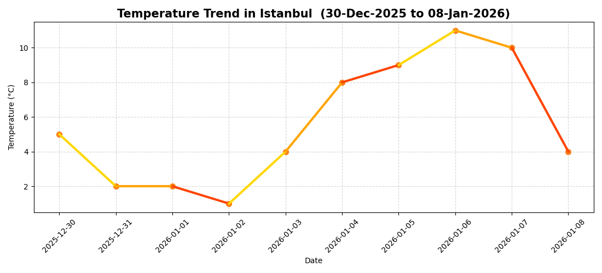
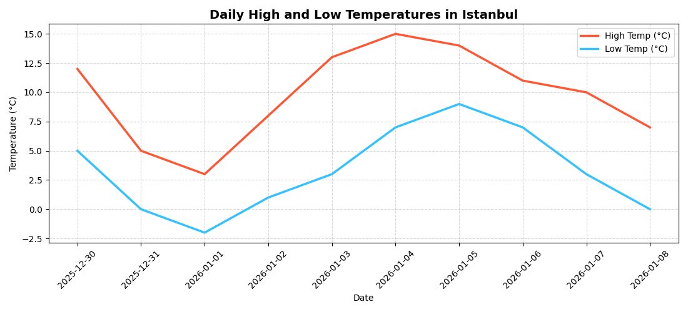
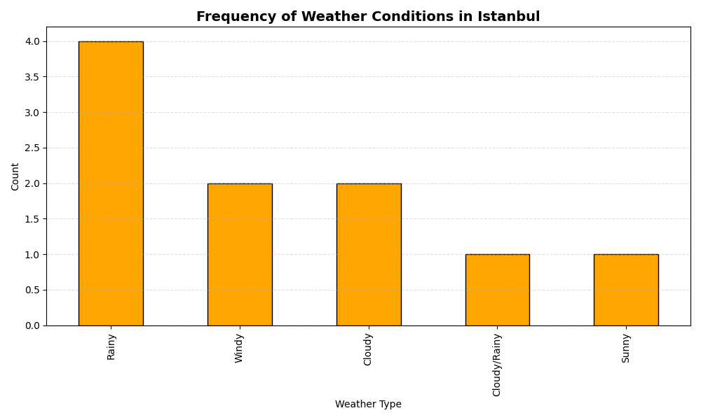
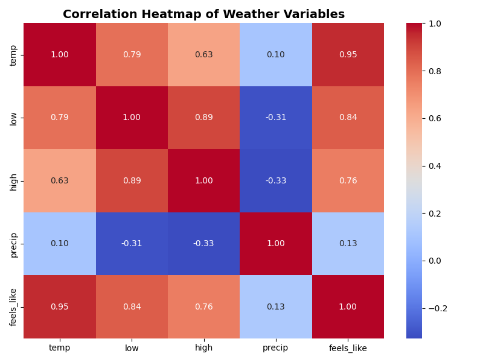
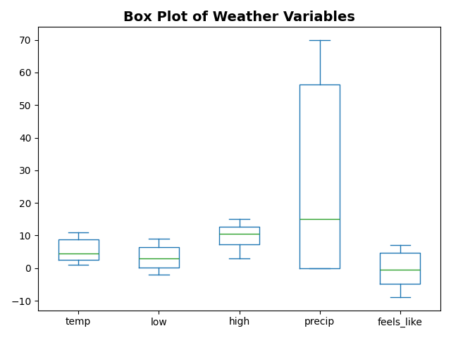

J-GRIT FOR PYTHON FINAL PROJECT
 PROJECT TITLE :


  ☁️ (Weather Data Analysis & Visualization)

 This project uses a real-world weather dataset manually collected from Apple Weather for Istanbul between 30 December 2025 and 08 January 2026.

 Each daily entry (temperature, feels-like, precipitation, high/low, and condition type ) was verified manually to create an accurate and reliable dataset for analysis.


 The goal of this project is to demonstrate a full data pipeline-ingestion, cleaning, visualization, and live scraping- using clean modular Python code.

 This is a Python-based project that analyzes Istanbul weather trends using parsed JSON data,web scraping,statistical analysis,and advanced data visualization techniques.

 This project was built to resemble a real data science workflow rather than a simple assignment.


 This project was developed as a complete pipeline including:
  
  - Data ingestion (JSON)
  - Data cleaning & preprocessing
  - Statistical analysis
  - Anomaly detection
  - Advanced visualization (Matplotlib + Seaborn: heatmaps,boxplots,multi-line trends)
  - Live weather scraping (WTTR API)
  - Exporting structured scraped data for testing 
  - Full modular project structure 


 
  
  ### 📂 Project Structure 
  ```
  J-GRIT-FOR-PYTHON-FINAL-PROJECT-
  |
  |--analysis/
  |   |---__init__.py
  |   |--- boxplots.png -> Statistical distribution / outliers (boxplot)
  |   |--- correlation_heatmap.png -> Variable correlations(heatmap)
  |   |--- feels_like.png -> Actual vs feels-like temperature
  |   |--- high_low_temps.png -> Daily high & low temperatures
  |   |--- plots.py  -> All visualizations (Matplotlib +  Seaborn)
  |   |--- precipitation.png -> Daily precipitation levels
  |   |--- stats.py  -> cleaning,summary stats,anomaly 
  |   |--- temp_trend.png -> Temperature trend over time 
  |   |--- weather_conditions.png -> Frequency of weather condition types 
  |
  |
  |---data/
  |   |---raw_weather.json    -> Provided dataset
  |   |---scraped_weather.csv -> Live scraped weather (WTTR API)
  |
  |
  |---- .gitignore        -> Ignored files & folders
  |---- LICENSE           -> MIT License
  |---- main.py           -> Main analysis pipeline
  |---- README.md         -> Project documentation
  |---- scrape_weather.py -> Web scraping & data cleaning script
  ```


  1. Data Ingestion
  This project loads weather data from two sources:

  A.JSON File(Primary Dataset)

  located at:data/raw_weather.json
  This file contains 10 days of Istanbul weather data including:
  
  - Temperature
  - Feels-like temperature
  - High/Low
  - Precipitation
  - Weather condition


  B.Web Scraping 

  The script scrape_weather.py fetches real-time weather from:

   - https://wttr.in/Istanbul?format=j1

   It extracts messy raw data and converts it into a structured CSV:

  data/scraped_weather.csv


  2. Data Cleaning 

  Cleaning is performed in stats.py:

  - Convert all numeric columns->float
  - Convert dates into datetime objects
  - Forward-fill & backward-fill missing values 
  - Standardize dataset for analysis and visualization 


  3. Statistical Analysis

  The project computes:

  - Average temperature 
  - Maximum temperature
  - Minimum temperature 
  - Average precipitation 

  Results are printed cleanly in main.py.


  4. Anomaly Detection 

  Uses Z-score to identify unusual temperature values:
  
  - if Z > 2 -> anomaly detected
  - if none present -> prints:
     " No temperature anomalies detected."


  5. Visualizations (Matplotlib+Seaborn)

  All plots saved inside analysis/: 
  ### Temperature Trend 
  
    
  smooth color-gradient line showing temperature change over 10 days.

  ### High/Low Temperatures
  

  Daily high and low temperature comparison.

  ### Weather Conditions Frequency 
  

  Bar chart counting how many times each condition occurred.
  
  ### Feels-like vs Actual Temperature 
  

  Comparison of perception vs real measurement.

  ### Correlation Heatmap 
  

  Seaborn heatmap showing relationships between all variables.

  ### Boxplots
  

  Statistical distribution visualized for outliers & spread.


  6. Web Scraping

  scrape_weather.py performs real-time scraping:


  - Extracts temperature , humidity , wind speed , precipitation , condition
  - Prints raw messy data
  - Cleans->converts into a structured DataFrame
  - Saves output into:
   data/scraped_weather.csv

   This demonstrates:
   - Handling messy API/web data
   - Cleaning pipeline
   - Exporting structured weather data 


   7. Requirements
    
   - pip install pandas matplotlib seaborn requests


   8. How to Run the Project ?

   'Run main analysis pipeline
   - python3 main.py

   - Sample output:

    === WEATHER DATA ===
    (date, temp, precip ...)

    Analyzing weather data...
    {'avg_temp':5.6, 'max_temp':15.0, 'min_temp':-2.0, 'avg_precip':27.0}
    
    ===ANOMALY DETECTION REPORT===
    No temperature anomalies detected

    Creating weather plots...
    Analysis complete. Charts saved in the analysis folder!


   'Run live web scraping
   - python3 scrape_weather.py

   'All plots will appear inside:
   - analysis/


  9. License
   MIT license


  10. Bonuses Used in this project 

  Visualization:
  - Matplotlib
  - Seaborn

  Dataset:
  - Clean downloaded data
  - Scraped messy web data


  Analysis:
  - Summary stats
  - Boxplots+heatmap
  - Anomaly detection


  11. Technologies Used
  - Python 3
  - Pandas (data manipulation)
  - Matplotlib (visualization)
  - Seaborn (advanced visualization)
  - Requests (API / web scraping)
  

  12. Conclusion
   This project turns real weather data into clear insights through a simple, modular pipeline-cleaning, analysis,
   visualization, and live scraping-working together to show how a complete data workflow can be built in Python. 

